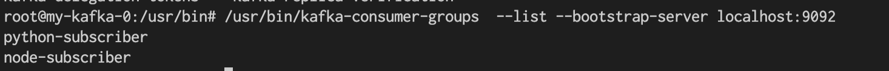
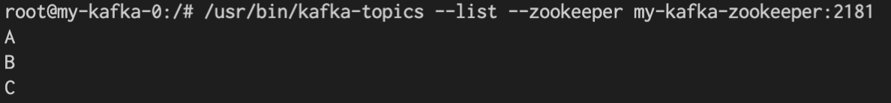
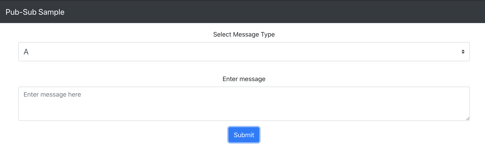
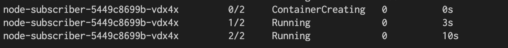
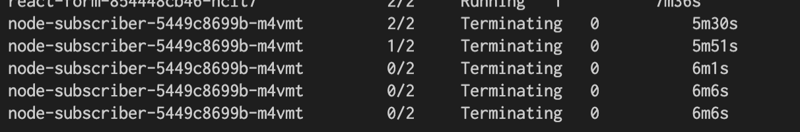

# Kuberntes cluster preparation

```
kind create cluster --name serverless --config kind-config.yaml
```

# KEDA installation

```
helm repo add kedacore https://kedacore.github.io/charts
kubectl create namespace keda
helm install keda kedacore/keda --namespace keda
```

# Kafka installation

```
helm repo add incubator http://storage.googleapis.com/kubernetes-charts-incubator
helm install my-kafka incubator/kafka
```

# Create sample pub/sub application with Kafka

```
kubectl apply -f ./deploy
```

Check Kafka internal consumer groups.

```
kubectl exec -it my-kafka-0 -- /bin/bash 
```



We can confirm that both consumer groups of `python-subscriber` and `node-subscriber` were created.



# Test

## Scale up

Send event from `http://reactform.127.0.0.1.xip.io:31502/`.



```
{"level":"info","ts":1597302886.6969903,"logger":"scalehandler","msg":"Successfully updated deployment","ScaledObject.Namespace":"default","ScaledObject.Name":"kafka-scaler","ScaledObject.ScaleType":"deployment","Deployment.Namespace":"default","Deployment.Name":"node-subscriber","Original Replicas Count":0,"New Replicas Count":1}
```



## Scale down

Wait without any new events.

```
{"level":"info","ts":1597306209.360775,"logger":"scalehandler","msg":"Successfully scaled deployment to 0 replicas","ScaledObject.Namespace":"default","ScaledObject.Name":"kafka-scaler","ScaledObject.ScaleType":"deployment","Deployment.Namespace":"default","Deployment.Name":"node-subscriber"}
```



# Kafka retention setting

```
kubectl exec -it my-kafka-0 -- /bin/bash -c '/usr/bin/kafka-topics --zookeeper my-kafka-zookeeper:2181 --alter --topic A --config retention.ms=1000'
```

# Set scaled object

