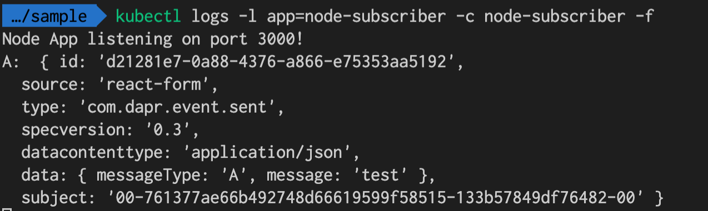

# Dapr Pub-sub sample on kind

### Install Kind 

```
./on-kind/init.sh
```

### Install Dapr

https://github.com/dapr/samples/tree/master/2.hello-kubernetes

```
dapr init -k
```

check status

```
dapr status -k
```

### Install redis

```
helm repo add bitnami https://charts.bitnami.com/bitnami
helm install redis bitnami/redis
```

### Install sapmle pods

Get password from secret

```
kubectl get secret --namespace default redis -o jsonpath="{.data.redis-password}" | base64 --decode
```

Input this password to `redis.yaml`

```
  - name: redisPassword
    value: <password>
```

```
kubectl apply -f .
```


### Test 

Access http://reactform.127.0.0.1.xip.io

Input and submit.


Check logs in node pod.

```
kubectl logs -l app=node-subscriber -c node-subscriber -f
```



```
kubectl logs -l app=python-subscriber -c python-subscriber -f
```

